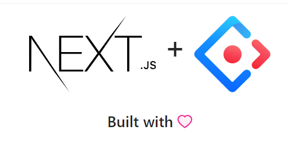
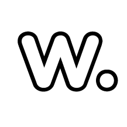

# Ant Design Pro Layout boilerplate



This example shows how to use Next.js along with [Ant Design Pro Layout](https://github.com/ant-design/ant-design-pro-layout) of React. This is intended to show the integration of this UI toolkit with the Framework.

## Live Demo

[Here](https://next-with-ant-design.vercel.app/)

## Deploy your own

Deploy the example using [Vercel](https://vercel.com):

[](https://vercel.com/import/project?template=https://github.com/Destructor1702/next-with-ant-design)


Install it and run:

```bash
git clone https://github.com/Destructor1702/next-with-ant-design NextAnDApp
cd NextAnDApp
npm install
npm run dev
# or
yarn
yarn dev
```

Deploy it to the cloud with [Vercel](https://vercel.com/import?filter=next.js&utm_source=github&utm_medium=readme&utm_campaign=next-example) ([Documentation](https://nextjs.org/docs/deployment)).


## used by: 
[](https://weaglex.com)
