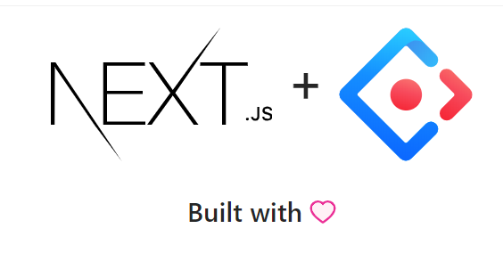

# Next.js + Ant Design



[](https://nextjs.org/)
[](https://ant.design/)
[](https://react.dev/)
[](https://www.typescriptlang.org/)
[](./LICENSE)

A modern boilerplate combining **Next.js 15**, **Ant Design 5**, and **TypeScript** with Pro Layout integration.

[Live Demo](https://next-with-ant-design.vercel.app/) · [Report Bug](https://github.com/DiegoVallejoDev/next-with-ant-design/issues) · [Request Feature](https://github.com/DiegoVallejoDev/next-with-ant-design/issues)

## Why this project?

Ant Design is one of the most widely adopted React component libraries in Asia, powering thousands of enterprise dashboards, admin tools, and SaaS products across the region. This boilerplate bridges Ant Design's mature component ecosystem with Next.js 15's performance and TypeScript's type safety, giving teams a production-ready starting point that follows the conventions they already know. It is especially useful for Asian startups and enterprises that want to ship consistent, accessible admin interfaces quickly without rebuilding the same layout, theming, and routing scaffolding from scratch.

## Tech Stack

- **Next.js** 15 (Pages Router)
- **React** 19
- **Ant Design** 5 with CSS-in-JS theming
- **TypeScript** 5 (strict mode)
- **@ant-design/pro-layout** 7

## Requirements

- Node.js 22.x

## Getting Started

```bash
git clone https://github.com/DiegoVallejoDev/next-with-ant-design
cd next-with-ant-design
npm install
npm run dev
```

Open [http://localhost:3000](http://localhost:3000) in your browser.

## Scripts

| Command         | Description              |
| --------------- | ------------------------ |
| `npm run dev`   | Start development server |
| `npm run build` | Build for production     |
| `npm run start` | Start production server  |
| `npm run lint`  | Run ESLint               |

## Theme Customization

Theme tokens are configured in `styles/theme.ts` using Ant Design's CSS-in-JS approach:

```typescript
import type { ThemeConfig } from "antd";

const theme: ThemeConfig = {
  token: {
    colorPrimary: "#ffae00",
    borderRadius: 2,
  },
};
```

To enable dark mode, add the algorithm:

```typescript
import { theme } from "antd";

const darkTheme: ThemeConfig = {
  token: { colorPrimary: "#ffae00" },
  algorithm: theme.darkAlgorithm,
};
```

See the [Ant Design Customize Theme docs](https://ant.design/docs/react/customize-theme) for all available tokens.

## Deploy

Deploy to [Vercel](https://vercel.com):

[](https://vercel.com/new/clone?repository-url=https://github.com/DiegoVallejoDev/next-with-ant-design)

## Project Structure

```
next-with-ant-design/
├── pages/
│   ├── _app.tsx          App wrapper with ConfigProvider + Layout
│   ├── _document.tsx     HTML document shell
│   ├── index.tsx         Landing page
│   ├── showcase.tsx      Full Ant Design component showcase
│   ├── welcome.tsx       Account settings page
│   ├── example.tsx       Interactive data table + statistics
│   ├── support.tsx       Contribution & donation page
│   └── api/
│       └── hello.ts      Sample API route
├── layouts/
│   └── main.tsx          ProLayout sidebar navigation
├── styles/
│   └── theme.ts          Ant Design theme token config
├── public/               Static assets (logos, images)
├── next.config.mjs       Next.js configuration (ESM)
├── tsconfig.json         TypeScript config (strict mode)
└── eslint.config.mjs     ESLint flat config
```

## Migrating from v1

If you're upgrading from the original v1 (antd 4 + React 17):

1. **Node.js 22.x** is now required
2. **Less is gone** — theme is configured in `styles/theme.ts` via CSS-in-JS tokens
3. **Component API changes** (antd 5):
   - `Select`: use `options` prop instead of `<Option>` children
   - `Modal/Drawer`: `visible` → `open`
   - `Tabs/Menu`: use `items` prop instead of JSX children
4. **Next.js Link**: no longer needs `<a>` child
5. **No `.babelrc`** — Next.js uses SWC by default

See [CHANGELOG.md](./CHANGELOG.md) for the full list of changes.

## License

[MIT](./LICENSE)
